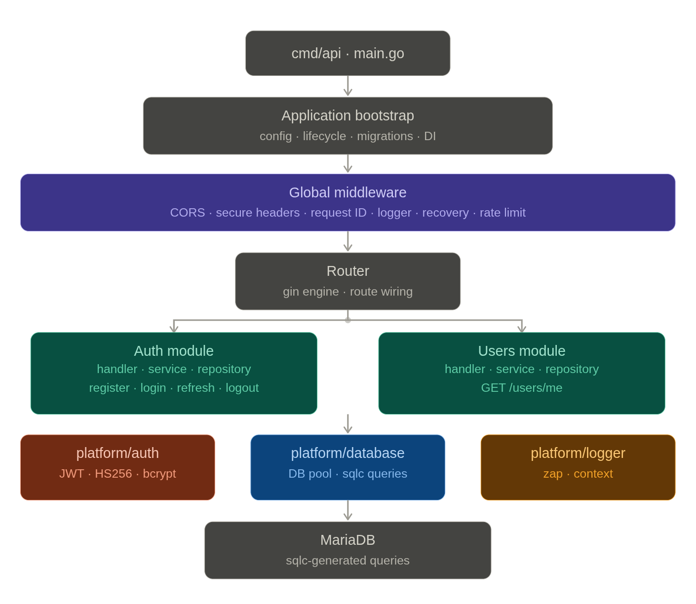
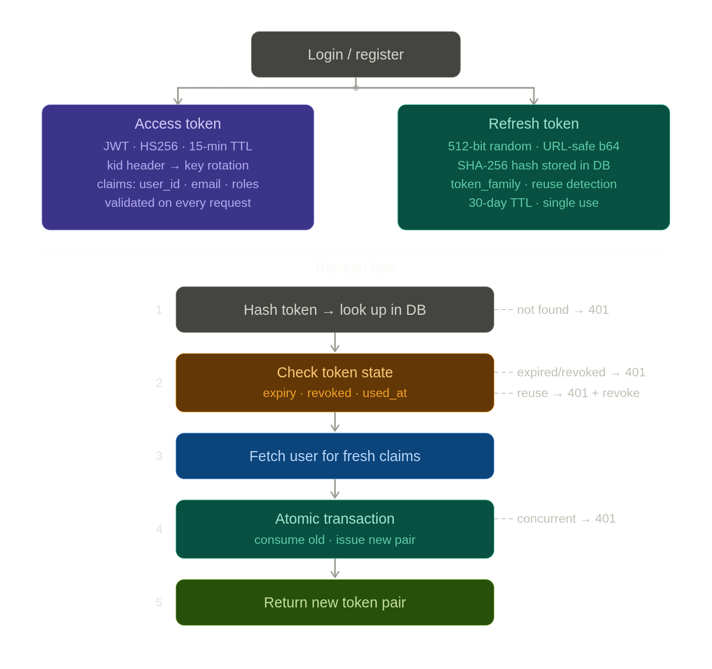

# Go Auth Boilerplate

Production-ready Go authentication boilerplate with JWT access + refresh tokens, token rotation, reuse detection, key-rotation support, and a clean modules-first architecture.

## Stack

| Concern            | Library / Tool                                                                    |
|--------------------|-----------------------------------------------------------------------------------|
| HTTP Router        | [gin-gonic/gin](https://github.com/gin-gonic/gin)                                 |
| Database           | MariaDB / MySQL via `go-sql-driver/mysql`                                         |
| Migrations         | [golang-migrate/migrate](https://github.com/golang-migrate/migrate) (embedded FS) |
| SQL Generation     | [sqlc](https://sqlc.dev)                                                          |
| JWT                | `golang-jwt/jwt` v5 — HS256 with multi-key rotation support                      |
| Password Hash      | bcrypt (`golang.org/x/crypto`) — cost 12                                         |
| Logging            | [uber-go/zap](https://github.com/uber-go/zap)                                     |
| Validation         | `go-playground/validator` v10                                                     |
| Config             | `joho/godotenv` + environment variables                                           |
| CORS               | `gin-contrib/cors`                                                                |
| Rate Limiting      | `golang.org/x/time/rate` + `hashicorp/golang-lru/v2` (expirable LRU)             |
| API Docs           | [swaggo/swag](https://github.com/swaggo/swag) + `swaggo/gin-swagger`             |

---

## App Architecture


## Token Design

---

## Quick Start

### Prerequisites

- Go 1.22+
- Docker + Docker Compose
- [sqlc](https://docs.sqlc.dev/en/latest/overview/install.html) — for regenerating DB code
- [swag](https://github.com/swaggo/swag) — for regenerating Swagger docs
- [golangci-lint](https://golangci-lint.run/usage/install/) — for linting

### 1. Clone & configure

```bash
git clone https://github.com/waqasmani/go-auth-boilerplate
cd go-auth-boilerplate
cp .env.example .env
# Edit .env — at minimum set JWT_SECRET (≥ 32 bytes) or JWT_KEYS
```

### 2. Run with Docker Compose (recommended)

```bash
docker compose up --build
# API available at http://localhost:8080
```

Migrations are applied automatically on startup via the embedded FS before the first query.

### 3. Run locally (requires MariaDB/MySQL)

```bash
# Start only the DB
make docker-db

# Apply migrations
make migrate

# Install dependencies
go mod download

# Run
make run
```

---

## API Endpoints

| Method | Path                     | Auth   | Description                        |
|--------|--------------------------|--------|------------------------------------|
| POST   | /api/v1/auth/register    | Public | Register & get token pair          |
| POST   | /api/v1/auth/login       | Public | Login & get token pair             |
| POST   | /api/v1/auth/refresh     | Public | Rotate refresh token               |
| POST   | /api/v1/auth/logout      | Public | Revoke refresh token family        |
| GET    | /api/v1/users/me         | JWT    | Get current user profile           |
| GET    | /health                  | Public | Health check                       |
| GET    | /swagger/*               | Public | Swagger UI (non-production only)   |

### Example: Register

```bash
curl -s -X POST http://localhost:8080/api/v1/auth/register \
  -H "Content-Type: application/json" \
  -d '{"name":"Alice","email":"alice@example.com","password":"securepass123!"}' | jq
```

### Example: Login

```bash
curl -s -X POST http://localhost:8080/api/v1/auth/login \
  -H "Content-Type: application/json" \
  -d '{"email":"alice@example.com","password":"securepass123!"}' | jq
```

### Example: Authenticated request

```bash
ACCESS_TOKEN="<access_token_from_login>"
curl -s http://localhost:8080/api/v1/users/me \
  -H "Authorization: Bearer $ACCESS_TOKEN" | jq
```

### Example: Refresh token

```bash
# Via JSON body (mobile / API clients)
curl -s -X POST http://localhost:8080/api/v1/auth/refresh \
  -H "Content-Type: application/json" \
  -d '{"refresh_token":"<your_refresh_token>"}' | jq

# Via cookie (web clients — cookie is set automatically on login/register)
curl -s -X POST http://localhost:8080/api/v1/auth/refresh \
  --cookie "refresh_token=<your_refresh_token>" | jq
```

---

## Token Design

```
Login / Register
      │
      ▼
┌─────────────────────┐       ┌───────────────────────────────────────┐
│ Access Token        │       │ Refresh Token (opaque, URL-safe b64)   │
│ JWT / HS256 (15 m)  │       │ SHA-256 hash stored in DB             │
│ Header: kid → key   │       │ • token_family (for reuse detection)   │
│ Claims:             │       │ • expires_at                          │
│  user_id            │       │ • used_at   (set on rotation)         │
│  email              │       │ • revoked_at (set on logout / reuse)  │
│  roles              │       └───────────────────────────────────────┘
└─────────────────────┘

Refresh flow:
  1. Hash the incoming token (SHA-256) and look it up in the DB
  2. If expired                → 401 TOKEN_EXPIRED
  3. If revoked_at is set      → 401 TOKEN_REVOKED  (prior logout or reuse event)
  4. If used_at is set         → REUSE DETECTED → revoke entire family → 401 TOKEN_REUSE_DETECTED
  5. Load user for up-to-date claims
  6. In a single transaction:
       a. Atomically mark old token used (UPDATE … WHERE used_at IS NULL)
       b. If RowsAffected == 0 → concurrent reuse → revoke family → 401
       c. Issue new access + refresh token (same family)
       d. Persist new hashed refresh token
  7. Return new token pair
```

---

## JWT Key Rotation

The service supports zero-downtime key rotation via a multi-key set.

### Single key (legacy / simple deployments)

```env
JWT_SECRET=<output of: openssl rand -hex 64>
```

### Multi-key rotation (recommended for production)

```env
# Step 1 — add new key as inactive, deploy
JWT_KEYS=[{"id":"v1","secret":"<old_key>","active":true},{"id":"v2","secret":"<new_key>","active":false}]

# Step 2 — promote new key to active, deploy
#           Old tokens (signed with v1) still validate until they expire.
JWT_KEYS=[{"id":"v1","secret":"<old_key>","active":false},{"id":"v2","secret":"<new_key>","active":true}]

# Step 3 — after old key's max TTL (RefreshTTL, default 30 d), remove it, deploy
JWT_KEYS=[{"id":"v2","secret":"<new_key>","active":true}]
```

Rules enforced at startup:
- Every key must have a non-empty `id` and a `secret` of **at least 32 bytes** (RFC 7518 §3.2)
- No two keys may share the same `id`
- Exactly one key must have `"active": true`

---

## Rate Limiting

Rate limiting uses a per-key in-process token bucket backed by an expirable LRU cache. No Redis is required.

| Route           | Policy                          |
|-----------------|---------------------------------|
| POST /login     | Shared per-IP bucket (brute-force protection) |
| POST /register  | Shared per-IP bucket (account-creation spam)  |
| POST /refresh   | Separate per-IP bucket (1 req/s, burst 5)     |
| POST /logout    | Unlimited                                     |
| GET  /users/me  | Unlimited (guarded by JWT)                    |

Global defaults are controlled by `RATE_LIMIT_*` environment variables. The key function is pluggable — see `middleware.KeyByIP`, `KeyByUserID`, `KeyByUserIDWithIPFallback`, and `KeyByHeader` for built-in options.

---

## Security Headers

Every response includes the following headers regardless of route:

| Header                    | Value                           | Purpose                                      |
|---------------------------|---------------------------------|----------------------------------------------|
| `X-Content-Type-Options`  | `nosniff`                       | Prevent MIME-type sniffing                   |
| `X-Frame-Options`         | `DENY`                          | Block clickjacking via iframe embedding      |
| `X-XSS-Protection`        | `0`                             | Disable legacy IE XSS auditor (OWASP rec.)   |
| `Referrer-Policy`         | `strict-origin-when-cross-origin` | Limit Referer leakage to third parties     |
| `Content-Security-Policy` | `default-src 'none'`            | No resource loading if mistakenly rendered   |
| `Strict-Transport-Security` | `max-age=…; includeSubDomains` | HTTPS-only — **opt-in via `SEC_HSTS_ENABLED=true`** |

HSTS is **disabled by default** and must be explicitly enabled in production where TLS termination is guaranteed.

---

## Makefile Commands

```bash
make run              # Run API locally
make build            # Compile binary to bin/
make test             # Unit tests (go test -race ./...)
make test-cover       # Tests with HTML coverage report
make test-integration # Integration tests (needs running DB)
make lint             # golangci-lint
make sqlc             # Regenerate DB code from SQL queries
make mock             # Regenerate mocks (needs mockgen)
make migrate          # Apply SQL migrations
make docker-up        # docker compose up --build
make docker-down      # docker compose down
make tidy             # go mod tidy
```

---

## Regenerating DB Code

After modifying `sql/queries/` or `sql/migrations/`:

```bash
make sqlc
```

This regenerates `internal/db/` from your SQL queries using [sqlc](https://sqlc.dev).

---

## API Documentation (Swagger)

Available at `http://localhost:8080/swagger/index.html` in non-production environments.

To regenerate after modifying handler annotations:

```bash
swag init -g cmd/api/swagger.go --output docs
```

---

## Testing

### Unit tests

```bash
go test -v -race ./internal/...
```

### Integration tests

Requires a running MariaDB (use `make docker-db` to start one):

```bash
# Start DB
make docker-db

# Apply migrations
make migrate

# Run
DB_DSN="root:rootpassword@tcp(localhost:3306)/auth_db?parseTime=true&charset=utf8mb4" \
  go test -v -race -tags=integration ./tests/integration/...
```

Or via Make:

```bash
make docker-db && sleep 5 && make migrate && make test-integration
```

---

## Environment Variables

### Core

| Variable          | Default                         | Description                                    |
|-------------------|---------------------------------|------------------------------------------------|
| `APP_ENV`         | `development`                   | `development` or `production`                  |
| `APP_PORT`        | `8080`                          | HTTP listen port                               |
| `DB_DSN`          | *(required)*                    | MariaDB DSN with `parseTime=true`              |
| `FRONT_END_DOMAIN`| `http://localhost:3000`         | Used to scope the `refresh_token` cookie domain |

### JWT

| Variable          | Default                         | Description                                    |
|-------------------|---------------------------------|------------------------------------------------|
| `JWT_KEYS`        | —                               | JSON key set (preferred); see Key Rotation above |
| `JWT_SECRET`      | *(required if JWT_KEYS absent)* | Legacy single-key secret (≥ 32 bytes)          |
| `JWT_KEY_ID`      | `default`                       | `kid` to assign to the legacy `JWT_SECRET`     |
| `JWT_ISSUER`      | `go-auth-boilerplate`           | JWT `iss` claim                                |
| `JWT_AUDIENCE`    | `go-auth-boilerplate-users`     | JWT `aud` claim                                |
| `JWT_ACCESS_TTL`  | `15m`                           | Access token TTL                               |
| `JWT_REFRESH_TTL` | `720h`                          | Refresh token TTL (30 days)                    |

### Rate Limiting

| Variable               | Default  | Description                                  |
|------------------------|----------|----------------------------------------------|
| `RATE_LIMIT_RATE`      | `5.0`    | Token refill rate (tokens/second)            |
| `RATE_LIMIT_BURST`     | `10`     | Token bucket capacity                        |
| `RATE_LIMIT_TTL`       | `10m`    | Idle entry eviction window                   |
| `RATE_LIMIT_MAX_KEYS`  | `10_000` | Max tracked keys in the LRU cache            |

### CORS

| Variable                   | Default                                       | Description                         |
|----------------------------|-----------------------------------------------|-------------------------------------|
| `CORS_ALLOWED_ORIGINS`     | `http://localhost:3000`                       | Comma-separated origin allowlist    |
| `CORS_ALLOWED_HEADERS`     | `Authorization,Content-Type,X-Request-ID`    | Extra request headers to permit     |
| `CORS_ALLOW_CREDENTIALS`   | `true`                                        | Expose response to credentialed XHR |
| `CORS_MAX_AGE`             | `43200`                                       | Preflight cache TTL (seconds)       |

### Security Headers

| Variable            | Default      | Description                                              |
|---------------------|--------------|----------------------------------------------------------|
| `SEC_HSTS_ENABLED`  | `false`      | Enable `Strict-Transport-Security` header (HTTPS only!)  |
| `SEC_HSTS_MAX_AGE`  | `63_072_000` | HSTS `max-age` in seconds (default 2 years)              |

### Proxy

| Variable               | Default       | Description                                                   |
|------------------------|---------------|---------------------------------------------------------------|
| `TRUSTED_PROXY_CIDRS`  | `10.0.0.0/8`  | CIDRs trusted to set `X-Forwarded-For` / `X-Real-IP`         |

---

## Security Notes

- Passwords hashed with bcrypt (cost **12**)
- Refresh tokens are 512-bit cryptographically random values (URL-safe base64); only the SHA-256 hex hash is persisted
- Token rotation: each refresh token is single-use; reuse triggers atomic family-wide revocation
- Concurrent rotation race handled at the DB level — `ConsumeRefreshToken` uses `UPDATE … WHERE used_at IS NULL`; `RowsAffected == 0` is treated as reuse
- Access tokens carry a `kid` header; validation selects the matching key without trying the full set
- Trusted proxy CIDRs are enforced to prevent `X-Forwarded-For` spoofing in production (`gin.SetTrustedProxies`)
- All DB queries go through sqlc prepared statements — no raw string interpolation
- Request body size is capped at **64 KB** globally

---

## License

MIT