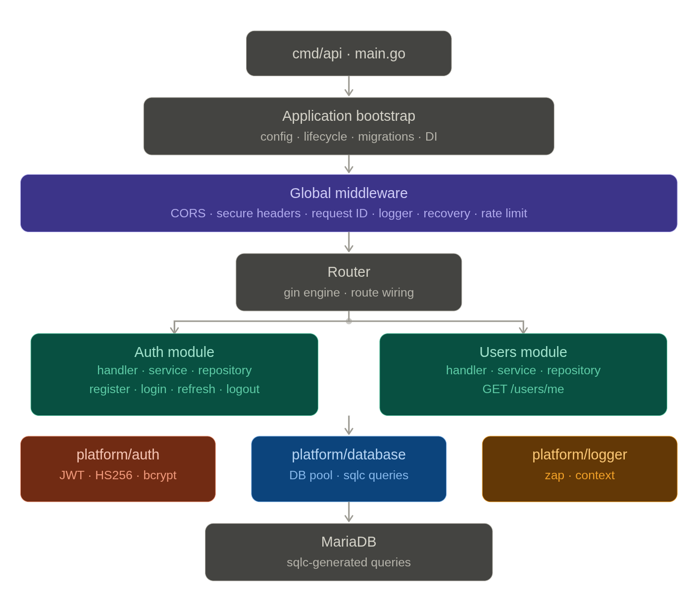
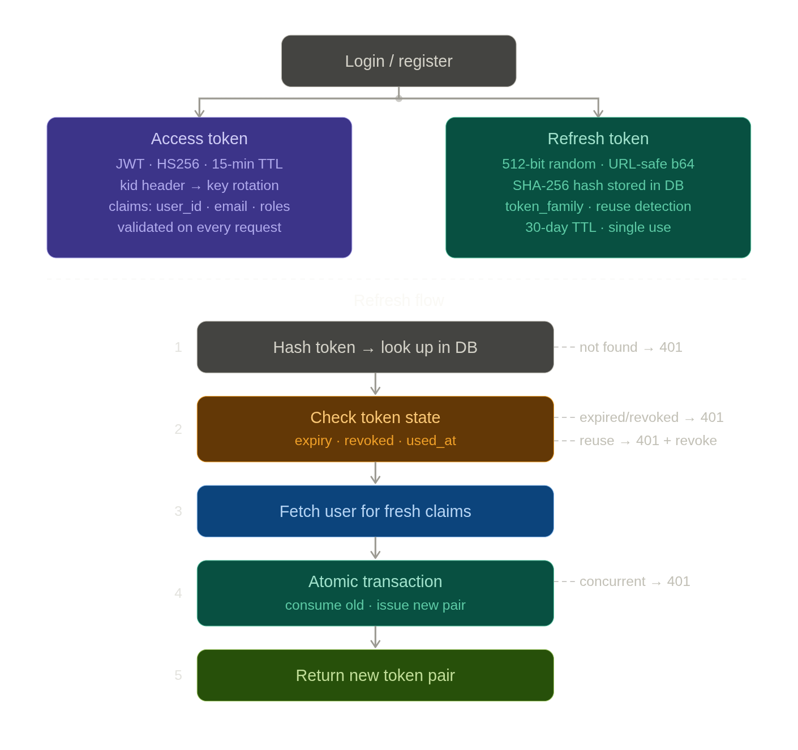

# Go Auth Boilerplate

Production-ready Go authentication boilerplate with JWT access + refresh tokens, token rotation, reuse detection, key-rotation support, email-based auth flows, and multi-factor authentication (OTP/TOTP).

## Stack

| Concern            | Library / Tool                                                                    |
|--------------------|-----------------------------------------------------------------------------------|
| HTTP Router        | [gin-gonic/gin](https://github.com/gin-gonic/gin)                                 |
| Database           | MariaDB / MySQL via `go-sql-driver/mysql`                                         |
| Migrations         | [golang-migrate/migrate](https://github.com/golang-migrate/migrate) (embedded FS) |
| SQL Generation     | [sqlc](https://sqlc.dev)                                                          |
| JWT                | `golang-jwt/jwt` v5 — HS256 with multi-key rotation support                       |
| Password Hash      | bcrypt (`golang.org/x/crypto`) — cost 12                                          |
| Logging            | [uber-go/zap](https://github.com/uber-go/zap)                                     |
| Validation         | `go-playground/validator` v10                                                     |
| Config             | [`spf13/viper`](https://github.com/spf13/viper) (env + optional YAML/JSON/TOML file) + `joho/godotenv` (`.env`) |
| CORS               | `gin-contrib/cors`                                                                |
| Rate Limiting      | `golang.org/x/time/rate` + `hashicorp/golang-lru/v2` (expirable LRU)              |
| API Docs           | [swaggo/swag](https://github.com/swaggo/swag) + `swaggo/gin-swagger`              |
| Email              | Native SMTP client (RFC 5322 compliant, no external dependency)                   |
| TOTP               | `pquerna/otp` (RFC 6238 compliant)                                                |

---

## App Architecture



---

## Quick Start

### Prerequisites

- Go 1.25+
- Docker + Docker Compose
- [sqlc](https://docs.sqlc.dev/en/latest/overview/install.html) — for regenerating DB code
- [swag](https://github.com/swaggo/swag) — for regenerating Swagger docs
- [golangci-lint](https://golangci-lint.run/usage/install/) — for linting

### 1. Clone & configure

```bash
git clone https://github.com/waqasmani/go-auth-boilerplate  
cd go-auth-boilerplate

# Option A (recommended) — generate a .env from .env.example with strong values
# for the app's own cryptographic secrets (JWT_KEYS, OTP_HMAC_SECRET, TOTP_KEYS,
# OAUTH_STATE_SECRET, OAUTH_TOKEN_KEYS, METRICS_TOKEN). It does NOT set the
# infrastructure credentials (DB_PASSWORD, DB_ROOT_PASSWORD, REDIS_PASSWORD and
# the passwords in DB_DSN/REDIS_DSN) — you define those to match your database /
# cache. Won't overwrite an existing .env unless you pass FORCE=1.
make env-init
# ...then set DB_*/REDIS_PASSWORD and DB_DSN/REDIS_DSN (and any OAuth client IDs).

# Option B — copy the template and fill secrets in by hand.
cp .env.example .env
# Need just the secret values? `make gen-secrets` prints a ready-to-paste block.
```

### 2. Run with Docker Compose (recommended)

```bash
cp .env.example .env      # if you haven't already
docker compose up --build
# API available at http://localhost:8080
```

No secrets are baked into `docker-compose.yml` — it reads everything from your
`.env` (the bundled `db` and `redis` services and the API container). Compose
refuses to start until `DB_ROOT_PASSWORD`, `DB_PASSWORD`, and `REDIS_PASSWORD`
are set; the API's `DB_DSN`/`REDIS_DSN` are wired to the compose service names
automatically. The default `.env.example` boots in **development** mode with
placeholder secrets that are long enough to start. For a **production-mode** run
(`APP_ENV=production`) you must provide strong, unique, randomly-generated
secrets — the app refuses to boot in production with placeholder/low-entropy
values.

Migrations are applied automatically on startup via the embedded FS (golang-migrate)
before the first query. They are intentionally **not** also loaded via MariaDB's
init scripts, so the schema is applied exactly once.

### 3. Run locally (requires MariaDB/MySQL)

```bash
# Start only the DB
make docker-db

# Apply migrations
make migrate

# Install dependencies
go mod download

# Run
make run
```

---

## API Endpoints

### Core Authentication

| Method | Path                     | Auth   | Description                        |
|--------|--------------------------|--------|------------------------------------|
| POST   | /api/v1/auth/register    | Public | Register & get token pair          |
| POST   | /api/v1/auth/login       | Public | Login & get token pair (or MFA challenge) |
| POST   | /api/v1/auth/refresh     | Public | Rotate refresh token               |
| POST   | /api/v1/auth/logout      | Public | Revoke refresh token family        |
| GET    | /api/v1/users/me         | JWT    | Get current user profile           |

### Email-Based Auth Flows (`/auth-email`)

| Method | Path                          | Auth   | Description                                      |
|--------|-------------------------------|--------|--------------------------------------------------|
| POST   | /api/v1/auth/forgot-password  | Public | Request password-reset email                     |
| POST   | /api/v1/auth/reset-password   | Public | Reset password using one-time token              |
| POST   | /api/v1/auth/verify-email     | Public | Verify email address using one-time token        |
| POST   | /api/v1/auth/resend-verification | Public | Resend verification email (unauthenticated)    |
| POST   | /api/v1/auth/send-verification | JWT   | Resend verification email (authenticated)        |

### Multi-Factor Authentication (OTP/TOTP)

| Method | Path                          | Auth   | Description                                      |
|--------|-------------------------------|--------|--------------------------------------------------|
| POST   | /api/v1/auth/otp/send         | JWT    | Send 2FA one-time passcode via email             |
| POST   | /api/v1/auth/otp/verify       | Public | Verify OTP code (standalone or MFA login completion) |
| POST   | /api/v1/auth/mfa/totp/setup   | JWT    | Generate TOTP secret + QR code (pending state)   |
| POST   | /api/v1/auth/mfa/totp/enable  | JWT    | Activate TOTP with confirmation code             |
| POST   | /api/v1/auth/mfa/totp/disable | JWT    | Disable TOTP, revert to email OTP                |

### System

| Method | Path                     | Auth   | Description                        |
|--------|--------------------------|--------|------------------------------------|
| GET    | /livez                   | Public | Liveness — process is up (no dependency checks) |
| GET    | /readyz                  | Public | Readiness — DB + Redis reachable   |
| GET    | /health                  | Public | Readiness alias (backward compat)  |
| GET    | /metrics                 | Public/Token | Prometheus metrics (gated by `METRICS_TOKEN` when set) |
| GET    | /swagger/*               | Public | Swagger UI (non-production only)   |

---

## Authentication Flows

### Standard Login (No 2FA)
```
POST /auth/login
{
  "email": "user@example.com",
  "password": "securepass123!"
}
→ 200 OK
{
  "access_token": "...",
  "refresh_token": "...",
  "token_type": "Bearer",
  "access_token_expires_at": "...",
  "refresh_token_expires_at": "..."
}
```

### Login with 2FA Enabled (MFA Challenge)
```
POST /auth/login
{
  "email": "user@example.com",
  "password": "securepass123!"
}
→ 200 OK (MFA challenge)
{
  "requires_mfa": true,
  "mfa_token": "challenge_abc123...",
  "expires_at": "2024-01-01T12:05:00Z"
}

# Client prompts user for code, then:
POST /auth/otp/verify
{
  "code": "123456",
  "mfa_token": "challenge_abc123..."
}
→ 200 OK (full token pair)
{
  "access_token": "...",
  "refresh_token": "...",
  ...
}
```

### Email Verification Flow
```
1. User registers → verification email sent automatically
2. User clicks link or submits token:
   POST /auth/verify-email
   { "token": "verification_token_xyz" }
   → 200 OK { "message": "email address verified successfully" }
3. User can now login
```

### Password Reset Flow
```
1. User requests reset:
   POST /auth/forgot-password
   { "email": "user@example.com" }
   → 200 OK (always returns success to prevent enumeration)

2. User receives email with reset link, clicks or submits:
   POST /auth/reset-password
   {
     "token": "reset_token_xyz",
     "new_password": "newSecurePass123!"
   }
   → 200 OK
   # Note: Email is unverified after reset; user must re-verify
```

### TOTP Setup & Enable Flow
```
1. Authenticated user requests TOTP setup:
   POST /auth/mfa/totp/setup
   → 200 OK
   {
     "secret": "JBSWY3DPEHPK3PXP",
     "uri": "otpauth://totp/...",
     "qr_base64": "iVBORw0KGgoAAAANSUhEUgAA..."
   }

2. User scans QR code in authenticator app, then confirms:
   POST /auth/mfa/totp/enable
   { "code": "123456" }  # Code from authenticator app
   → 200 OK { "message": "TOTP enabled..." }

3. Future logins now require TOTP code via MFA challenge flow
```

---

## Token Design

```
Login / Register
      │
      ▼
┌─────────────────────┐       ┌───────────────────────────────────────┐
│ Access Token        │       │ Refresh Token (opaque, URL-safe b64)   │
│ JWT/HS256 (5m def.) │       │ SHA-256 hash stored in DB             │
│ Header: kid → key   │       │ • token_family (for reuse detection)   │
│ Claims:             │       │ • expires_at                          │
│  user_id            │       │ • used_at   (set on rotation)         │
│  email              │       │ • revoked_at (set on logout / reuse)  │
│  roles              │       └───────────────────────────────────────┘
└─────────────────────┘

Refresh flow:
  1. Hash the incoming token (SHA-256) and look it up in the DB
  2. If expired                → 401 TOKEN_EXPIRED
  3. If revoked_at is set      → 401 TOKEN_REVOKED
  4. If used_at is set         → REUSE DETECTED → revoke entire family → 401 TOKEN_REUSE_DETECTED
  5. Load user for up-to-date claims
  6. In a single transaction:
       a. Atomically mark old token used (UPDATE … WHERE used_at IS NULL)
       b. If RowsAffected == 0 → concurrent reuse → revoke family → 401
       c. Issue new access + refresh token (same family)
       d. Persist new hashed refresh token
  7. Return new token pair
```

---

## OTP Security Implementation

### Email OTP (6-digit codes)
- **Storage**: Codes are NEVER stored in plaintext. Each OTP is hashed with HMAC-SHA256 using a server-side secret (`OTP_HMAC_SECRET`) before database insertion.
- **Why HMAC?**: A plain SHA-256 hash of a 6-digit code is trivially reversible (only 1,000,000 possible values). Keying the digest with a server-only secret prevents rainbow-table attacks even if the database is compromised.
- **TTL**: 10 minutes by default (`otpTokenTTL` constant)
- **Brute-force cap**: Each wrong code increments a per-challenge counter; after `OTP_MAX_ATTEMPTS` (default 5) the MFA challenge is **burned**, forcing re-authentication. This is the primary defence — the per-IP rate limit alone would not stop a distributed attacker grinding the 10⁶ code space. The same cap protects the TOTP completion path.

### TOTP (Authenticator App)
- **Secret Storage**: TOTP secrets are encrypted with AES-256-GCM before storage. The encryption key set supports rotation (mirroring JWT key rotation).
- **Key Rotation**: 
  1. Add new key with `Active: false` to `TOTP_KEYS`
  2. Deploy — existing secrets decrypt with old key
  3. Set new key `Active: true`, old key `Active: false`
  4. Deploy — new secrets encrypt with new key
  5. Optionally re-encrypt stored secrets, then remove old key
- **Validation**: ±1 step clock skew tolerance (RFC 6238 compliant)
- **Blob Format**: `[1-byte keyID_len][keyID][12-byte GCM nonce][ciphertext+tag]`

### MFA Challenge Token
- Short-lived (5 minutes), single-use token that links an OTP verification to a specific login attempt
- Prevents replay attacks where a valid OTP could be reused for a different session
- Hashed with SHA-256 before storage (high entropy, no HMAC needed)

---

## JWT Key Rotation

The service supports zero-downtime key rotation via a multi-key set.

### Single key (legacy / simple deployments)
```env
JWT_SECRET=<output of: openssl rand -hex 64>
```

### Multi-key rotation (recommended for production)
```env
# Step 1 — add new key as inactive, deploy
JWT_KEYS=[{"id":"v1","secret":"<old_key>","active":true},{"id":"v2","secret":"<new_key>","active":false}]

# Step 2 — promote new key to active, deploy
#           Old tokens (signed with v1) still validate until they expire.
JWT_KEYS=[{"id":"v1","secret":"<old_key>","active":false},{"id":"v2","secret":"<new_key>","active":true}]

# Step 3 — after old key's max TTL (RefreshTTL, default 30 d), remove it, deploy
JWT_KEYS=[{"id":"v2","secret":"<new_key>","active":true}]
```

`make rotate-key` automates steps 1–2 (new active key appended, old keys demoted
and stamped with a `created` timestamp). Step 3 is automated too — instead of
hand-editing, retire keys past their TTL by age:

```bash
make prune-keys KEY=JWT_KEYS OLDER_THAN=720h   # drop inactive keys minted >30 d ago
```

`prune-keys` never removes the active key, and never removes inactive keys that
lack a `created` timestamp (minted before timestamped rotation, age unknown) —
those are reported so you can remove them by hand once you're sure no live token
still uses them.

> **Multi-instance deployments:** `rotate-key` / `prune-keys` edit a local
> `.env`. With more than one replica, make a shared secrets store (Vault, AWS
> Secrets Manager, SSM, Kubernetes Secret) the source of truth so every instance
> reads the same key set. Drive rotation against it with the stdout form —
> `go run ./cmd/gensecrets -rotate JWT_KEYS` (reads `$JWT_KEYS`, prints the new
> value) — and push that value into the store, then roll all replicas.

Rules enforced at startup:
- Every key must have a non-empty `id` and a `secret` of **at least 32 bytes** (RFC 7518 §3.2)
- No two keys may share the same `id`
- Exactly one key must have `"active": true`

---

## Rate Limiting

Rate limiting uses a **Redis-backed** atomic token bucket (Lua), so limits are
consistent across every instance in a multi-pod deployment. **Redis is a
mandatory dependency** — the limiter, account lockout, and TOTP replay cache all
require it, and the app will not start without a reachable instance. The limiter
**fails closed**: if Redis is unreachable, requests on protected routes are
rejected rather than allowed through.

### Per-Route Policies

| Route                     | Policy                                          | Purpose                              |
|---------------------------|-------------------------------------------------|--------------------------------------|
| POST /login               | Per-IP + **Per-email** (0.1 req/s, burst 5)     | Block brute-force & credential stuffing (per-email key is not XFF-spoofable) |
| POST /register            | Per-IP (5 req/s, burst 10)                      | Prevent account-creation spam        |
| POST /refresh             | Per-IP (1 req/s, burst 5) + CSRF check          | Protect token rotation endpoint      |
| POST /forgot-password     | Per-IP (3 req/min, burst 5)                     | Prevent enumeration/spam (email send is async to avoid a timing oracle) |
| POST /reset-password      | Per-IP (5 req/min, burst 5)                     | Limit reset attempts                 |
| POST /verify-email        | Per-IP (10 req/min, burst 10)                   | Allow quick verification retries     |
| POST /otp/verify          | Per-IP (5 req/min, burst 5) **+ per-challenge attempt cap** | An MFA challenge is burned after `OTP_MAX_ATTEMPTS` (default 5) wrong codes — the primary defence against brute-forcing the 6-digit code |
| POST /mfa/totp/enable     | Per-user (5 attempts/min) + JWT auth            | Protect TOTP activation              |

> The per-IP keys above derive the client IP from `X-Forwarded-For` **only**
> when the request arrives from a CIDR listed in `TRUSTED_PROXY_CIDRS`. In
> production this list is required and may not be a trust-all range (`0.0.0.0/0`),
> so a client cannot spoof its IP to evade per-IP limits or forge audit-log IPs.

Global defaults are controlled by `RATE_LIMIT_*` environment variables. The key function is pluggable — see `middleware.KeyByIP`, `KeyByUserID`, `KeyByUserIDWithIPFallback`, and `KeyByHeader` for built-in options.

---

## Security Headers

Every response includes the following headers regardless of route:

| Header                    | Value                           | Purpose                                      |
|---------------------------|---------------------------------|----------------------------------------------|
| `X-Content-Type-Options`  | `nosniff`                       | Prevent MIME-type sniffing                   |
| `X-Frame-Options`         | `DENY`                          | Block clickjacking via iframe embedding      |
| `X-XSS-Protection`        | `0`                             | Disable legacy IE XSS auditor (OWASP rec.)   |
| `Referrer-Policy`         | `strict-origin-when-cross-origin` | Limit Referer leakage to third parties     |
| `Content-Security-Policy` | `default-src 'none'`            | No resource loading if mistakenly rendered   |
| `Strict-Transport-Security` | `max-age=…; includeSubDomains` | HTTPS-only — **opt-in via `SEC_HSTS_ENABLED=true`** |

HSTS is **disabled by default** and must be explicitly enabled in production where TLS termination is guaranteed.

---

## Makefile Commands

```bash
make env-init         # Generate a complete .env from .env.example (app secrets; FORCE=1 to overwrite)
make gen-secrets      # Print freshly-generated values for the app's secret env vars
make rotate-key KEY=JWT_KEYS  # Rotate a key set in .env (new active key; old kept for validation)
make prune-keys KEY=JWT_KEYS OLDER_THAN=720h  # Retire inactive keys older than the window (active key kept)
make run              # Run API locally
make build            # Compile binary to bin/
make test             # Unit tests (go test -race ./...)
make test-cover       # Tests with HTML coverage report
make test-integration # Integration tests (needs running DB)
make lint             # golangci-lint
make sqlc             # Regenerate DB code from SQL queries
make mock             # Regenerate mocks (needs mockgen)
make migrate          # Apply SQL migrations
make docker-up        # docker compose up --build
make docker-down      # docker compose down
make tidy             # go mod tidy
```

---

## Regenerating DB Code

After modifying `sql/queries/` or `sql/migrations/`:

```bash
make sqlc
```

This regenerates `internal/db/` from your SQL queries using [sqlc](https://sqlc.dev).

---

## API Documentation (Swagger)

Available at `http://localhost:8080/swagger/index.html` in non-production environments.

To regenerate after modifying handler annotations:

```bash
swag init -g cmd/api/swagger.go --output docs
```

---

## Testing

### Unit tests
```bash
go test -v -race ./internal/...
```

### Integration tests
Requires a running MariaDB (use `make docker-db` to start one):

```bash
# Start DB
make docker-db

# Apply migrations
make migrate

# Run
DB_DSN="root:rootpassword@tcp(localhost:3306)/auth_db?parseTime=true&charset=utf8mb4" \
  go test -v -race -tags=integration ./tests/integration/...
```

Or via Make:
```bash
make docker-db && sleep 5 && make migrate && make test-integration
```

---

## Configuration

Configuration is loaded through [Viper](https://github.com/spf13/viper). Values
resolve in this order (highest precedence first):

1. **Environment variables** — read directly via Viper's `AutomaticEnv` (and a
   `.env` file is loaded into the environment first by `godotenv`, so the
   existing `cp .env.example .env` workflow is unchanged).
2. **Optional config file** — set `CONFIG_FILE=/path/to/config.yaml`, or drop a
   `config.yaml` (or `.json`/`.toml`) in the working directory or `./config`.
   Keys are flat and case-insensitive, mirroring the env-var names. See
   [`config.example.yaml`](config.example.yaml).
3. **Built-in defaults** — the fallbacks documented below.

Anything set in the environment overrides the same key in the config file.
Secrets and complex JSON values (`JWT_KEYS`, `TOTP_KEYS`, `OAUTH_TOKEN_KEYS`)
are best supplied via the environment rather than a committed file.

## Environment Variables

### Core
| Variable          | Default                         | Description                                    |
|-------------------|---------------------------------|------------------------------------------------|
| `APP_ENV`         | `development`                   | `development` or `production`                  |
| `APP_PORT`        | `8080`                          | HTTP listen port                               |
| `DB_DSN`          | *(required)*                    | MariaDB DSN with `parseTime=true`              |
| `FRONT_END_DOMAIN`| `http://localhost:3000`         | Used to scope the `refresh_token` cookie domain |

### JWT
| Variable          | Default                         | Description                                    |
|-------------------|---------------------------------|------------------------------------------------|
| `JWT_KEYS`        | —                               | JSON key set (preferred); see Key Rotation above |
| `JWT_SECRET`      | *(required if JWT_KEYS absent)* | Legacy single-key secret (≥ 32 bytes)          |
| `JWT_KEY_ID`      | `default`                       | `kid` to assign to the legacy `JWT_SECRET`     |
| `JWT_ISSUER`      | `go-auth-boilerplate`           | JWT `iss` claim                                |
| `JWT_AUDIENCE`    | `go-auth-boilerplate-users`     | JWT `aud` claim                                |
| `JWT_ACCESS_TTL`  | `5m`                            | Access token TTL                               |
| `JWT_REFRESH_TTL` | `720h`                          | Refresh token TTL (30 days)                    |

### OTP / TOTP
| Variable          | Default                         | Description                                    |
|-------------------|---------------------------------|------------------------------------------------|
| `OTP_HMAC_SECRET` | *(required, ≥32 bytes)*         | Server secret for HMAC-SHA256 hashing of OTP codes |
| `TOTP_KEYS`       | —                               | JSON array of AES-256 keys for TOTP secret encryption |
| `TOTP_SECRET`     | *(legacy fallback)*             | Single TOTP encryption key (treated as `v1`)   |
| `TOTP_ISSUER`     | `go-auth-boilerplate`           | Label shown in authenticator apps              |
| `TOTP_PERIOD`     | `30`                            | TOTP step size in seconds (RFC 6238 default)   |
| `TOTP_DIGITS`     | `6`                             | Code length: `6` or `8`                        |

### Email (SMTP)
| Variable             | Default              | Description                              |
|----------------------|----------------------|------------------------------------------|
| `EMAIL_SMTP_HOST`    | —                    | SMTP server hostname                     |
| `EMAIL_SMTP_PORT`    | `1025`               | SMTP server port                         |
| `EMAIL_SMTP_USERNAME`| —                    | SMTP authentication username             |
| `EMAIL_SMTP_PASSWORD`| —                    | SMTP authentication password             |
| `EMAIL_SMTP_USE_TLS` | `false`              | Use implicit TLS (port 465 style)        |
| `EMAIL_FROM`         | `App <noreply@example.com>` | Sender address for outgoing emails |

> **Note**: If `EMAIL_SMTP_HOST` is empty, the mailer is disabled and all email-sending operations become no-ops (useful for local development).

### Rate Limiting
| Variable               | Default  | Description                                  |
|------------------------|----------|----------------------------------------------|
| `RATE_LIMIT_RATE`      | `5.0`    | Token refill rate (tokens/second)            |
| `RATE_LIMIT_BURST`     | `10`     | Token bucket capacity                        |
| `RATE_LIMIT_TTL`       | `10m`    | Idle entry eviction window                   |
| `RATE_LIMIT_MAX_KEYS`  | `10_000` | Max tracked keys in the LRU cache            |
| `RATE_LIMIT_LOGIN_EMAIL` | `0.1`  | Per-account login limiter (1 attempt/10s)    |
| `RATE_LIMIT_FORGOT_PASSWORD` | `0.05` | Forgot-password endpoint (3/min)         |
| `RATE_LIMIT_RESET_PASSWORD` | `0.083` | Reset-password endpoint (5/min)          |
| `RATE_LIMIT_OTP_VERIFY` | `0.083` | OTP verification endpoint (5/min)            |
| `RATE_LIMIT_AUTH_REFRESH` | `1.0` | Refresh token endpoint (1 req/s)             |

### CORS
| Variable                   | Default                                       | Description                         |
|----------------------------|-----------------------------------------------|-------------------------------------|
| `CORS_ALLOWED_ORIGINS`     | `http://localhost:3000`                       | Comma-separated origin allowlist    |
| `CORS_ALLOWED_HEADERS`     | `Authorization,Content-Type,X-Request-ID`     | Extra request headers to permit     |
| `CORS_ALLOW_CREDENTIALS`   | `true`                                        | Expose response to credentialed XHR |
| `CORS_MAX_AGE`             | `43200`                                       | Preflight cache TTL (seconds)       |

### Security Headers
| Variable            | Default      | Description                                              |
|---------------------|--------------|----------------------------------------------------------|
| `SEC_HSTS_ENABLED`  | `false`      | Enable `Strict-Transport-Security` header (HTTPS only!)  |
| `SEC_HSTS_MAX_AGE`  | `63_072_000` | HSTS `max-age` in seconds (default 2 years)              |

### Proxy
| Variable               | Default       | Description                                                   |
|------------------------|---------------|---------------------------------------------------------------|
| `TRUSTED_PROXY_CIDRS`  | *(none)*      | Comma-separated CIDRs trusted to set `X-Forwarded-For` / `X-Real-IP`. **Required in production** and validated at startup: an empty list or a trust-all range (`0.0.0.0/0`, `::/0`) is rejected. In development, forwarded headers are ignored entirely. |

> The full, authoritative list of environment variables — including session
> lifetime (`JWT_REFRESH_ABSOLUTE_TTL`), MFA brute-force cap (`OTP_MAX_ATTEMPTS`),
> DB pool, server timeouts, `DB_ALLOW_INSECURE`, `COOKIE_REFRESH_TOKEN_IN_BODY`,
> and observability (`METRICS_ENABLED`, `METRICS_TOKEN`) — lives in
> [`.env.example`](.env.example) with inline documentation for each.

---

## Security Notes

- **Passwords**: Hashed with bcrypt (cost **12**) after SHA-256 pre-hashing to handle arbitrary-length inputs correctly (defeats the bcrypt 72-byte truncation pitfall)
- **Refresh tokens**: 512-bit cryptographically random values (URL-safe base64); only the SHA-256 hex hash is persisted
- **Token rotation**: Each refresh token is single-use; reuse triggers atomic family-wide revocation
- **Absolute session lifetime**: A refresh-token family carries a fixed deadline (`JWT_REFRESH_ABSOLUTE_TTL`, default 90 d) that is preserved across rotations, so a continuously-rotated (e.g. silently stolen) session cannot extend indefinitely
- **Concurrent rotation race**: Handled at the DB level — the rotation transaction's first op is `SELECT … FOR UPDATE`, then `ConsumeRefreshToken` uses `UPDATE … WHERE used_at IS NULL`; `RowsAffected == 0` is treated as reuse
- **Refresh token delivery**: Always set as an `HttpOnly` cookie; echoing it in the JSON body is toggleable via `COOKIE_REFRESH_TOKEN_IN_BODY` (set `false` for browser-only clients)
- **Access tokens**: HMAC-only with algorithm pinning (`jwt.WithValidMethods` + a keyfunc type-assertion) — `alg:none` and RS/HS confusion are rejected before key lookup; the `kid` header selects the matching key with no fallback; a small clock-skew leeway is applied
- **MFA brute-force**: An MFA challenge is burned after `OTP_MAX_ATTEMPTS` (default 5) wrong OTP/TOTP codes; TOTP replays are rejected within the validity window via a fail-closed Redis cache (RFC 6238 §5.2)
- **Disabling MFA**: Requires the current TOTP code **and** password re-authentication (for password accounts)
- **Secrets**: Required at startup; in production, placeholder / low-entropy secrets are rejected (length-only checks are not sufficient)
- **Trusted proxy CIDRs**: Required in production and validated — empty or trust-all (`0.0.0.0/0`) is rejected — preventing `X-Forwarded-For` spoofing (`gin.SetTrustedProxies`)
- **Database**: TLS required in production (`tls=` in `DB_DSN`) unless `DB_ALLOW_INSECURE=true`; connection pool is configurable
- **All DB queries**: Go through sqlc prepared statements (or parameterized `?` placeholders) — no raw string interpolation
- **Request limits**: Body capped at **64 KB**; query string capped; `ReadHeaderTimeout` set (Slowloris) plus read/write/idle timeouts and a header-size cap
- **OTP codes**: HMAC-SHA256 hashed before storage; server secret (`OTP_HMAC_SECRET`) prevents rainbow-table attacks
- **TOTP secrets**: AES-256-GCM encrypted with key-rotation support; key ID embedded in ciphertext blob
- **Audit logging**: All security-critical events (login, logout, password reset, MFA actions, token reuse) logged to a named `audit` stream for SIEM integration; email addresses are masked (PII minimisation)
- **CORS**: Wildcard origins are rejected whenever credentials are enabled
- **CSRF protection**: Origin/Referer validation on cookie-bearing endpoints (`/auth/refresh`, `/auth/logout`)
- **OAuth**: Mandatory S256 PKCE, HMAC-signed state with constant-time verification, exact-match redirect allowlist, and **single-use state** enforced server-side (Redis) within the state TTL
- **Observability**: `GET /livez` (liveness, no dependency checks), `GET /readyz` (readiness — DB + Redis), and a Prometheus `GET /metrics` (optionally bearer-token protected via `METRICS_TOKEN`)

---

## Module Pattern (Adding Features)

When adding a new feature module:

1. Create directory: `internal/modules/<feature>/`
2. Implement files:
   - `dto.go` — Request/Response structs with validation tags
   - `repository.go` — Data access interface + sqlc-backed implementation
   - `service.go` — Business logic (pure Go, no HTTP concerns)
   - `handler.go` — HTTP layer (bind, validate, call service, respond)
   - `routes.go` — Gin route registration with middleware
   - `module.go` — Dependency wiring (`NewModule` function)
3. Wire in `internal/app/app.go` and register routes in `internal/router/router.go`
4. Add SQL to `sql/queries.sql` or migrations in `sql/migrations/`, then run `make sqlc`

---

## License

MIT

---